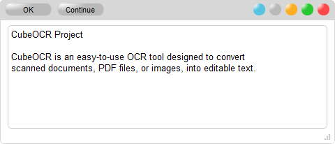

# CubeOCR
<a id="readme-top"></a>


**CubeOCR** project is a Python-based screenshot OCR tool designed to convert scanned documents, PDF files, or images, into editable text.


<br/>
<p align="center">
&emsp;

</p>
<br/>

## Key Features

- **User-Friendly Interface**: Simple and intuitive interface for easy use
- **Integrated Text Editor with Built-in Toolbar**: Capable of processing editable text, saving time and effort
- **Transparent Background**: Suitable for side by side paragraphs and code editing 
- **Advanced Image Pprocessing**: Enhance image quality with noise filtering features
- **Multi-Language Support**: Supports text recognition more than 107 different languages
- **Output Formats**: Supports various output formats: plain text, PDF, and Word documents
- **Hotkeys**: Activate OCR Screen, easily copy and paste to other applications


## Installation

Prerequisites: required software tools, libraries or system dependencies:
- Tesseract-OCR: Version 5.5 or newer [Download](https://github.com/UB-Mannheim/tesseract/wiki)
- Python: Version 3.11 or newer [Download](https://www.python.org/downloads/)
- Python packages: See `requirements.txt`

</br>


To install and run this project locally, follow the steps below:
1. Clone the repository:

    ```bash
    git clone https://github.com/username/repository.git
    cd repository
    ```

2. Create a virtual environment:

    ```bash
    python -m venv .venv
    .venv\Scripts\activate              # for Windows                    
    ```

3. Install the dependencies:

    ```bash
    pip install -r requirements.txt
    ```

4. To run the project:

    ```bash
    python app.py
    ```

## Usage

CubeOCR is an easy-to-use OCR tool designed to extract text from scanned documents, PDF files, or images. Simply select a text area, perform OCR, and be ready to paste it anywhere.

1. Select a text area on the screen.
2. Click the "OK" button after the OCR converstion
3. Paste the editable text to other applications


## Contributing

We welcome contributions from the community. Please follow these steps:
1. Fork the repository.
2. Create a new branch (`git checkout -b feature-branch`).
3. Make your changes.
4. Commit your changes (`git commit -m 'Add some feature'`).
5. Push to the branch (`git push origin feature-branch`).
6. Create a new pull request.


## License
- This project is licensed under the MIT. See the [LICENSE](https://github.com/OCR-tech/CubeOCR/blob/main/LICENSE) for details.
- This project depends on other software and packages using different open source licenses:
    - [Tesseract-OCR](https://github.com/UB-Mannheim/tesseract) uses the Apache License, Version 2.0. See the [LICENSE](http://www.apache.org/licenses/LICENSE-2.0) for details.
    - [Leptonica library](http://www.leptonica.org/) uses the BSD 2-clause License. See the [LICENSE](http://www.leptonica.org/about-the-license.html) for details.


## Contact
-  For any inquiries, please contact us at cubeocr.mail@gmail.com
-  Website: [https://ocr-tech.github.io/CubeOCR](https://ocr-tech.github.io/CubeOCR/)

